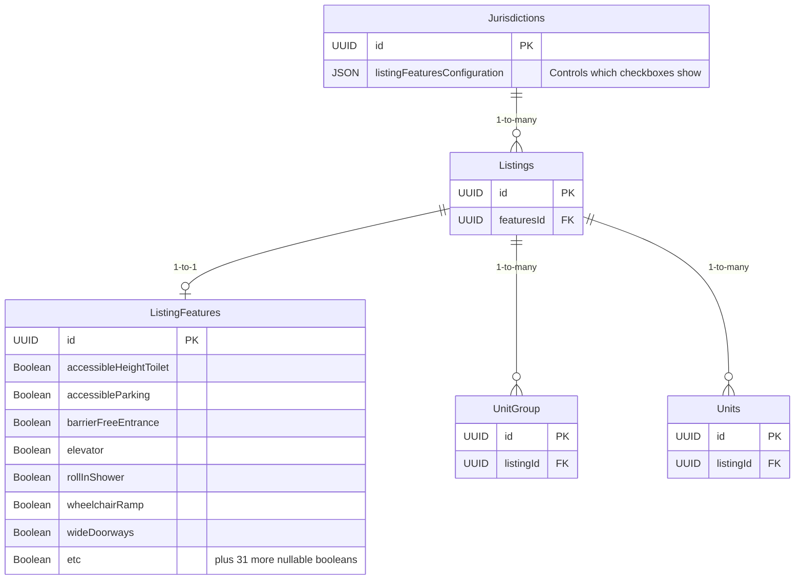
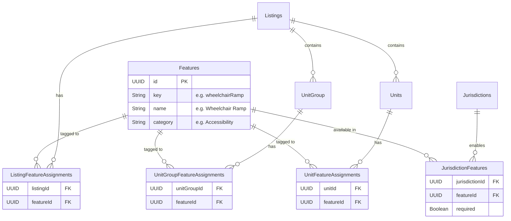

# Tech Design: Normalize the Features Data Schema

**Authors:** Jessica Liu
**Status:** Draft
**Date:** 2026-02-26

---

## 1. Problem Statement

The current data model stores building accessibility and amenity features as **38 hardcoded boolean columns** on the `ListingFeatures` table, which has a 1-to-1 relationship with the `Listings` model (a building).

This creates three problems:
1. **No unit-level granularity** — features can only describe an entire building, not a specific unit (e.g., "Unit 105 has a roll-in shower").
2. **Schema rigidity** — adding or removing a feature requires a database migration and code changes across backend DTOs, frontend forms, and tests.
3. **Data waste** — each `ListingFeatures` row stores 38 columns, of which typically only 2–5 are `true`; the rest are `null`.

## 2. Goals

- Replace the flat boolean schema with a normalized relational model that supports tagging features at the **Listing**, **UnitGroup**, and **Unit** levels.
- Align with RESO MLS data dictionary standards for interoperability.
- Simplify the process of adding/removing features (no migrations required — just insert/delete a row).
- Enable the public portal to search for features at any level of the hierarchy.

## 3. Non-Goals

- Migrating production data (no prod instance exists).
- Building an admin UI for managing the master feature list (seed scripts only for now).
- Changing the `UnitAccessibilityPriorityTypes` model (this remains separate — it's about applicant prioritization, not physical features).

---

## 4. Current vs Proposed Architecture

<details>
<summary><strong>View Current Schema Diagram</strong></summary>

Features are currently stored as **38 boolean columns** on a single table, attached only to Listings (buildings). Units and Unit Groups have no feature data.


</details>

<details open>
<summary><strong>View Proposed Schema Diagram</strong></summary>

Features will be stored in a **central dictionary** with **join tables** connecting them to Listings, Unit Groups, and Units. Jurisdiction configuration moves from JSONB to a relational table.


</details>

---

## 5. Prisma Schema Changes (Backend)

The `Features` table acts as a central dictionary.

```prisma
// Central dictionary of all features
model Features {
  id        String   @id() @default(dbgenerated("uuid_generate_v4()")) @db.Uuid
  createdAt DateTime @default(now()) @map("created_at") @db.Timestamp(6)
  updatedAt DateTime @updatedAt @map("updated_at") @db.Timestamp(6)

  name     String // Human-readable name (e.g., "Wheelchair Ramp")
  key      String @unique() // Machine key (e.g., "wheelchairRamp") for i18n lookups
  category String // Grouping category (e.g., "Accessibility", "Building Amenity")

  listingFeatureAssignments   ListingFeatureAssignments[]
  unitGroupFeatureAssignments UnitGroupFeatureAssignments[]
  unitFeatureAssignments      UnitFeatureAssignments[]
  jurisdictionFeatures        JurisdictionFeatures[]

  @@map("features")
}

// Which features a Jurisdiction cares about
model JurisdictionFeatures {
  jurisdictionId String @map("jurisdiction_id") @db.Uuid
  featureId      String @map("feature_id") @db.Uuid
  required       Boolean @default(false) // replaces category.required

  jurisdiction Jurisdictions @relation(fields: [jurisdictionId], references: [id])
  feature      Features      @relation(fields: [featureId], references: [id])

  @@id([jurisdictionId, featureId])
  @@map("jurisdiction_features")
}

// Join tables connecting Features to physical assets
model ListingFeatureAssignments {
  listingId String @map("listing_id") @db.Uuid
  featureId String @map("feature_id") @db.Uuid

  listing Listings @relation(fields: [listingId], references: [id], onDelete: Cascade)
  feature Features @relation(fields: [featureId], references: [id])

  @@id([listingId, featureId])
  @@map("listing_feature_assignments")
}

model UnitGroupFeatureAssignments { /* Similar shape to listing */ }
model UnitFeatureAssignments { /* Similar shape to listing */ }
```

### Seed Data
The `Features` table will be seeded entirely with the 38 existing fields, grouped normally:

```typescript
const FEATURE_SEEDS: { key: string; name: string; category: string }[] = [
  { key: "wheelchairRamp",       name: "Wheelchair Ramp",       category: "Accessibility" },
  { key: "rollInShower",         name: "Roll-In Shower",        category: "Accessibility" },
  { key: "barrierFreeEntrance",  name: "Barrier-Free Entrance", category: "Accessibility" },
  // ...
  { key: "acInUnit",             name: "A/C in Unit",           category: "Building Amenity" },
  { key: "inUnitWasherDryer",    name: "In-Unit Washer/Dryer",  category: "Building Amenity" },
];
```

---

## 6. API Contract Changes

All creation/update logic shifts from nested boolean objects to a simple array of IDs.

```diff
// Before (ListingCreate DTO / UnitCreate DTO)
- listingFeatures?: { wheelchairRamp?: boolean; ... }

// After (ListingCreate DTO / UnitCreate DTO)
+ featureIds?: string[]   // Array of Feature UUIDs
```

**New Endpoint for Form Population:**
```
GET /features?jurisdictionId={id}
```
*Returns the list of `Features` that a given Jurisdiction has enabled (via `JurisdictionFeatures`). The frontend calls this once to populate the checkbox options on the form.*

---

## 7. Search / Filter Impact

The `buildWhereClause` in `listing.service.ts` currently filters by `listingFeatures.{fieldName}: true`. 

The new filter logic will query across all three join tables using an `OR` block:

```typescript
// In buildWhereClause(), when a feature filter is present:
if (filter[ListingFilterKeys.features]) {
  const featureIds: string[] = filter[ListingFilterKeys.features];
  
  filters.push({
    OR: [
      { listingFeatureAssignments: { some: { featureId: { in: featureIds } } } },
      { unitGroups: { some: { unitGroupFeatureAssignments: { some: { featureId: { in: featureIds } } } } } },
      { units: { some: { unitFeatureAssignments: { some: { featureId: { in: featureIds } } } } } }
    ]
  });
}
```

---

## 8. Frontend Integration

### Partners Portal (Forms)

| Current | Proposed |
|---|---|
| `AccessibilityFeatures.tsx` reads `listingFeaturesConfiguration` JSON to conditionally render checkboxes | The component now calls `GET /features?jurisdictionId=X` on mount, rendering checkboxes dynamically. |
| Form state sends a bulky object `{ wheelchairRamp: true }` | Form state sends an array `{ featureIds: ["uuid-1", "uuid-2"] }` |

*Note: The exact same check-box component will be reused inside `UnitForm.tsx` and `UnitGroupForm.tsx` using the same dictionary API call!*

### Public Portal (Filter Drawer)

| Current | Proposed |
|---|---|
| `FilterDrawer.tsx` uses hardcoded UI logic based on Jurisdiction JSON variables | Component fetches `GET /features?jurisdictionId=X` and renders filter checkboxes dynamically from the API payload |

---

## 9. Next Steps / Open Questions

1. **Translations:** Should we maintain the current pattern where translation lookup keys rely on `Features.key` matching our hardcoded JSON locale files, or move Translations directly into a `FeatureTranslations` database table for easier adding of features later?
2. **Prioritization vs Features:** Should we keep the `UnitAccessibilityPriorityTypes` model as-is (used for applicant sorting), or should "Mobility", "Hearing", "Visual" become entries in the `Features` table with a special category?
3. **Scoping:** Do we need a `FeatureScope` enum (e.g., `BUILDING_ONLY`, `UNIT_ONLY`, `ANY`) on the `Features` table to prevent logically incorrect assignments (like tagging a single unit with "Elevator")?
